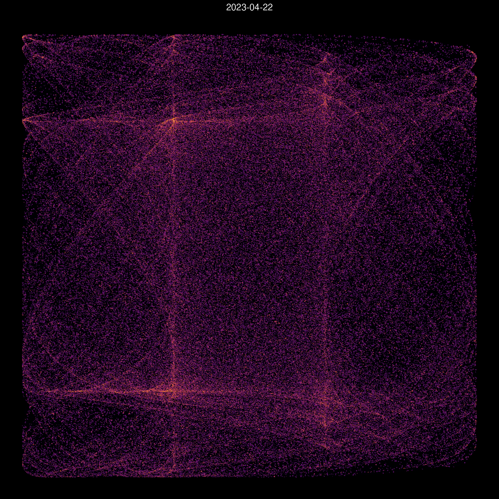

# One Attractor per Day

This repository simply creates a unique [attractor graph](https://dominiquemakowski.github.io/NeuropsyXart#attractors) everyday. It takes the date as parameters for Clifford's equations.

- Don't forget to **watch** this repo to see a link to new attractors on your GitHub's feed.
- Feel free to check out my art project [**NeuropsyXart**](https://dominiquemakowski.github.io/NeuropsyXart/) for more chaotic stuff.

<!-- TODO: Send automated tweet everyday https://github.com/marketplace/actions/send-tweet-action -->

